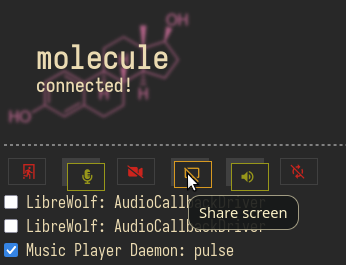

* Molecule
A featureful [[https://github.com/element-hq/element-call][element-call]] replacement, with such amazing 22nd century
improvements as *SYSTEM AUDIO SHARING*!!!

** How it works
Apart from the normal MatrixRTC + Livekit stuff,
Molecule also includes a daemon that enumerates Pipewire clients.
The frontend allows you to select which of these applications to record.
Their audio outputs will be bundled by the daemon into a single
F32 PCM stream at 48kHz, which is passed to the frontend via a websocket.
There, it's published as an additional audio track in the Livekit room
corresponding to your currently joined call.

** Usage guide
1. Have [[https://github.com/gomuks/gomuks][Gomuks Web]] running locally (on its standard port 29325)
2. Clone this repo & run =direnv allow= to get into the Nix devshell
3. Run =just frontend= & =just backend= separately
4. Access Gomuks through [[http://localhost:5173]]
5. Set your Element call base URL to that same address
6. Place a call; you should see Molecule starting!

Alternatively, if you don't want to develop the frontend,
bundle it with =just dist=, then serve Molecule through Caddy
on [[http://localhost:8080]] with =caddy run=.

** Why does Molecule need the same origin as Gomuks?
[[https://developer.mozilla.org/en-US/docs/Web/JavaScript/Reference/Global_Objects/SharedArrayBuffer#security_requirements][This is why,]] and we need SharedArrayBuffer for low-latency audio transport.

Don't ask me, I didn't make the rules ¯\_(ツ)_/¯
